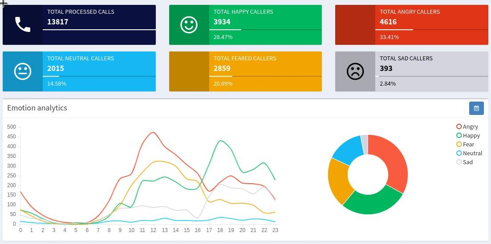

# Vocal Emotion Recognition System with [Dashboard](https://github.com/app-generator/flask-adminlte)

This project provides an emotion recognition system API with analytics dasboard. Using the provided APIs, clients are able request for analysis of a speech file. The server processes the audio file, returns back results to the client. SABA's dashboard provides analytics from data stored in database. 

Following picture illustrates SABA's dashboard. In this case, more than 13000 phone calls processed. The chart cearly depicts trend of each category over the time. Some other charts also provided in the dashboard.



NOTE: Quering data from database does not implemented in an efficient way. Therefore, in cases that too many records be saved in database, you will encounter with delay when opening the dashbord. I implemented this project when I was in early stages of learning FLASK; forgive me for this problem.

## Build from sources

```bash
$ cd {PROJECT_FOLDER}
$
$ # Virtualenv modules installation (Unix based systems)
$ virtualenv --no-site-packages env
$ source env/bin/activate
$
$ # Virtualenv modules installation (Windows based systems)
$ # virtualenv --no-site-packages env
$ # .\env\Scripts\activate
$
$ # Install modules - SQLite Database
$ pip3 install -r requirements.txt
$
$ # OR with PostgreSQL connector
$ # pip install -r requirements-pgsql.txt
$
$ # Set the FLASK_APP environment variable
$ (Unix/Mac) export FLASK_APP=run.py
$ (Windows) set FLASK_APP=run.py
$ (Powershell) $env:FLASK_APP = ".\run.py"
$
$ # Set up the DEBUG environment
$ # (Unix/Mac) export FLASK_ENV=development
$ # (Windows) set FLASK_ENV=development
$ # (Powershell) $env:FLASK_ENV = "development"
$
$ # Start the application (development mode)
$ # --host=0.0.0.0 - expose the app on all network interfaces (default 127.0.0.1)
$ # --port=5000    - specify the app port (default 5000)  
$ flask run --host=0.0.0.0 --port=5000
$
$ # Access the dashboard in browser: http://127.0.0.1:5000/
```
